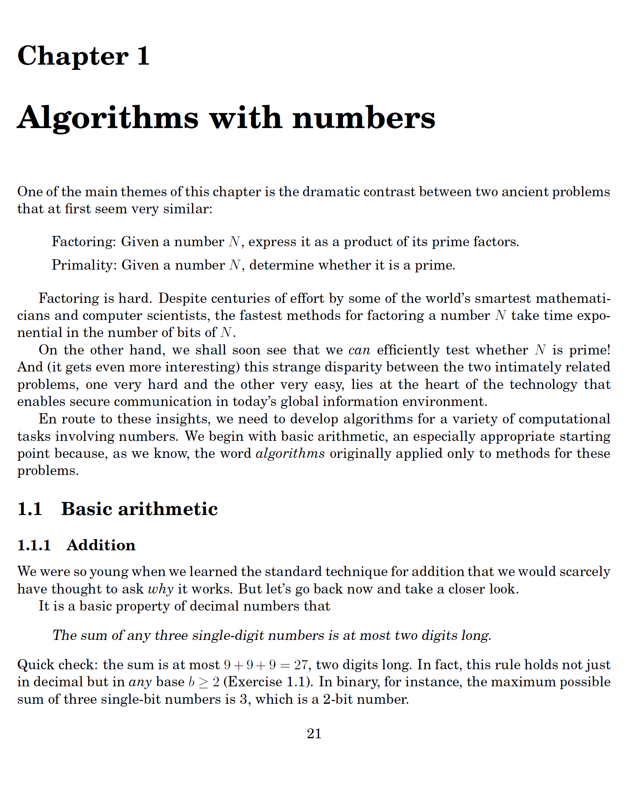

# Schedule

### [CMPSC 465 : Data Struc and Algor]

CMPSC 465 Is an expansion of proofing on Discrete Mathmatics combining, probabliites, calculus 3 and proofing techniques learned in CMPSC 360 like Induction, Strong Induction, etc. To understand algorithms, time complexity and understanding the underlying principles of how algorithms work, optimization, and overall cost of your programs and the way you choose to solve then. This course is starting to make me hate discrete math, I'm so lost starting already. 

Online Textbook I use from Virginia Tech for CMPSC 465 (<https://courses.cs.vt.edu/cs5114/spring2008/lectures/dasgupta-book/complete-book.pdf>)

### [DS 435 Data Ethics]

DS 435 is a class focusing on the Ethics and morality of what we as Data Science Engineers do. How times are changing day by day. With self driving cars, how mcuh data every app and service you use is collecting about you and how its using that. What data you can collect legally and how you have to disclose it. 

Standford data science sharing their thoughts on why data ethics is so important.
(<https://datascience.stanford.edu/research/research-areas/ethics-and-data-science>)

### [Graduate Photography]

Something I like to do in my spare time is photography. Specifically graduate photography. I've been doing photography for the past 4 years, I started in the senior year of HS and just conintued to take photos. I've made it a side hustle of mine, which helps to fund my college experience. Just this year I switched from using a subscription service known as pixieset to get my galleries out to clients, took me 2 weeks but I managed to reverse engineering pixieset and made my own version and self host my site. I've been making small chnages every week as I notice things but its going well so far. I use a Nikon Z8 with a 24-70 F2.8. 

I do graduate photography on the side. My website is attached, fully self hosted
(<https://sennetvisuals.com/graduation>)

